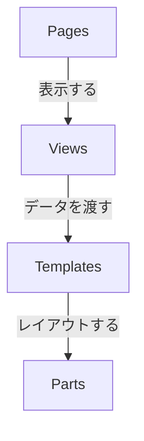

# DLR

## コミットメッセージ

- feat: 新しい機能
- fix: バグの修正
- docs: ドキュメントのみの変更
- style: 空白、フォーマット、セミコロン追加など
- refactor: 仕様に影響がないコード改善(リファクタ)
- perf: パフォーマンス向上関連
- test: テスト関連
- chore: ビルド、補助ツール、ライブラリ関連

```
feat: 〇〇なため、△△を追加
```

## コンポーネント設計

コンポーネントを以下の責務ごとに分割し、コードの保守性と再利用性を高めます。

### 依存関係



---

### 各レイヤーの責務

- **Parts (`/components/parts/`)**

  - ロジックを持たない最小単位の UI 部品（例: `Button`, `Input`）。
  - `props` に基づいて表示するだけの「ダムコンポーネント」。

- **Templates (`/components/templates/`)**

  - `Parts` を組み合わせて作るレイアウトの雛形（例: `UserList`, `ArticleGrid`）。
  - 具体的なデータは `props` で受け取る。

- **Views (`/components/views/`)**

  - API 通信などでデータを取得し、`Templates` に渡す役割。
  - ローディングやエラーなどのビジネスロジックを担当。

- **Pages (`/app/**/page.tsx`)\*\*
  - Next.js のルーティングエントリーポイント。
  - URL に応じた `View` を呼び出し、メタデータを設定する。

---

### ページ固有コンポーネントのルール

- **原則**: 1 つのページでしか使わないコンポーネントも、積極的にファイル分割する。
- **格納場所**: 共通の `/components` には置かず、**ページと同じ階層**に `_components` フォルダを作って格納する。
  - 例: `app/settings/_components/PasswordForm.tsx`

## AWS Lambda に外部パッケージ（BeautifulSoup など）を zip でアップロードして使う方法

このガイドでは、AWS Lambda 関数で `BeautifulSoup` や `requests` などの外部 Python パッケージを使用するために、zip ファイルを作成してアップロードする手順を説明します。

---

### ✅ 前提条件

- Python（例: Python 3.9）がローカルにインストールされている
- `pip` が使える
- AWS アカウントと Lambda 関数作成権限がある

---

### 1. 作業ディレクトリの作成

```bash
mkdir lambda_bs4_package
cd lambda_bs4_package
```

### 2.必要なパッケージのインストール

```bash
pip install beautifulsoup4 requests -t .
```

### 3.関数を書いて圧縮

```bash
zip -r9 lambda_function.zip .
```

### 4.Lambda にアップロード

コードソース」セクションで「アップロード」 → 「.zip ファイルをアップロード」を選択

# memo

python ファイル名

## tag

        ["528"],  # 本番なし
        ["156"],  # 男性受け
        ["115"],  # 逆レ
        ["523"],  # 乳首責め
        ["144"],  # 言葉責め
        ["032"],  # 純愛
        ["046"],  # ハーレム
        ["116"],  # 複数プレイ
        ["504"],  # おねショタ
        ["317"],  # 人外娘/モンスター娘
        ["526"],  # 快楽落ち
        ["536"],  # 女性優位
        ["162"],  # 触手
        ["136"],  # SM
        ["433"],  # 逆転なし
        ["149"],  # 羞恥/恥辱
        ["146"],  # 拘束
        ["514"],  # オナサポ
        ["525"],  # ざぁ〜こ
        ["524"],  # おほごえ
        ["316"],  # ヤンデレ
        ["157"],  # トランス/暗示
        ["314"],  # トランス/暗示ボイス
        ["447"],  # 風俗/ソープ
